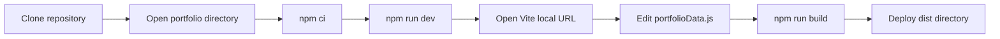
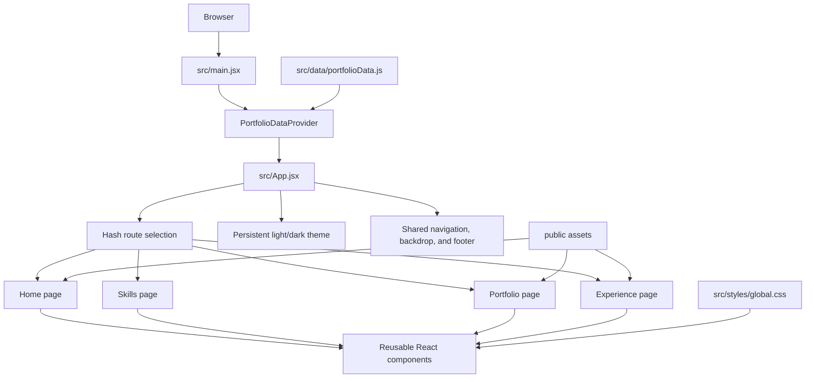
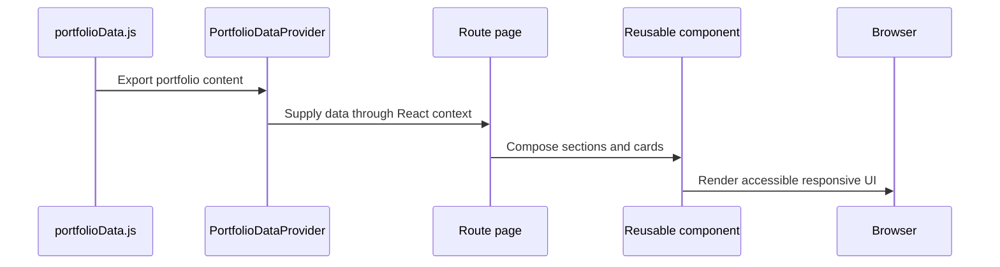
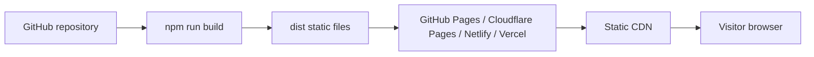

# Architecture and Installation Guide

This document is the technical companion to the project’s main [developer guide](../README.md). Use it for architecture decisions, installation diagrams, deployment flows, and other engineering documentation you want GitHub visitors to see.

## Documentation files

```text
portfolio/
├── README.md             # Developer setup, customization, and content schemas
└── docs/
    ├── README.md         # Architecture, diagrams, and deployment documentation
    └── assets/           # Exported PNG, SVG, WebP, or PDF diagrams
```

Store exported diagrams in `docs/assets/` and reference them with a relative link:

```md

```

GitHub renders Mermaid diagrams directly, so diagrams can also remain editable as text in this file.

## Installation flow



### Commands

```bash
git clone <your-repository-url>
cd <repository-name>/portfolio
npm ci
npm run dev
```

Create and inspect the production build with:

```bash
npm run build
npm run preview
```

## Application architecture



## Content flow



## Architectural responsibilities

| Area | Responsibility |
| --- | --- |
| `src/data/portfolioData.js` | Editable identity, navigation, skills, projects, experience, certificates, and social links |
| `src/context/` | Supplies configuration to React components and allows alternate data injection |
| `src/App.jsx` | Application shell, route registry, hash aliases, theme persistence, and page selection |
| `src/pages/` | Composes route-level sections without duplicating section logic |
| `src/components/` | Reusable UI, cards, navigation, image fallbacks, and interactive behavior |
| `src/hooks/` | Shared lifecycle behavior such as viewport reveal animations |
| `src/styles/global.css` | Design tokens, page styling, responsive rules, reduced motion, and both themes |
| `public/` | Static images, résumé, favicon, and other files served without bundling |

## Runtime characteristics

- React renders the entire frontend; Vite handles development and production bundling.
- Hash routes work on static hosting without server-side rewrite rules.
- There is no backend, database, authentication, admin page, or server-held secret.
- Portfolio content is compiled from the local configuration file.
- The theme preference is saved in browser local storage.
- Images have lazy-loading and visible fallback handling where appropriate.
- Animations respect `prefers-reduced-motion`.

## Deployment architecture



Only the generated `dist/` output needs to be served. Do not place API keys or private information in the source or environment variables exposed to Vite; frontend values can be inspected by visitors.

## Adding more technical documentation

Suggested sections to add here as the project evolves:

- Architecture decision records and trade-offs
- Component or data-flow diagrams
- Accessibility testing results
- Performance budgets and Lighthouse reports
- Deployment-provider configuration
- CI/CD workflow diagrams
- Release and rollback procedures
- Browser-support policy

For longer topics, create additional Markdown files under `docs/` and link them from this page. Keep screenshots and exported diagrams under `docs/assets/` so GitHub paths remain predictable.
